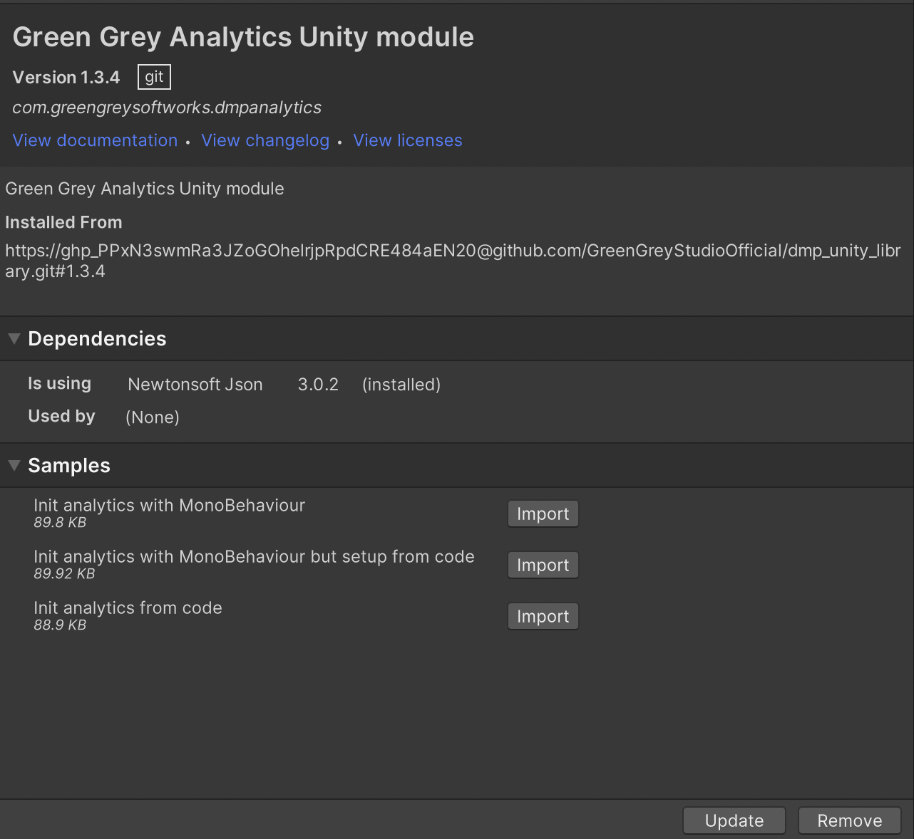
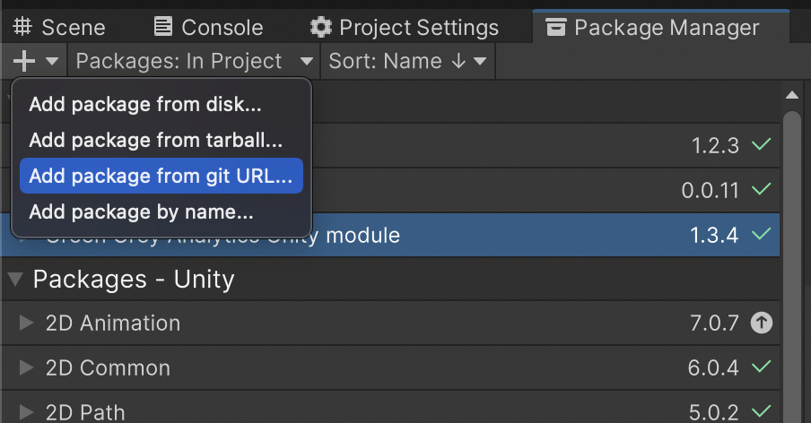
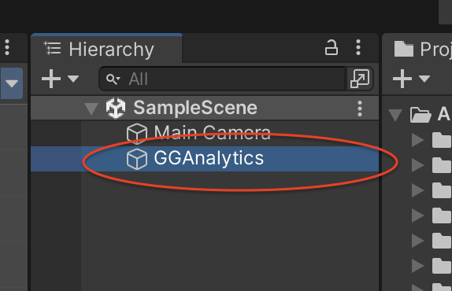
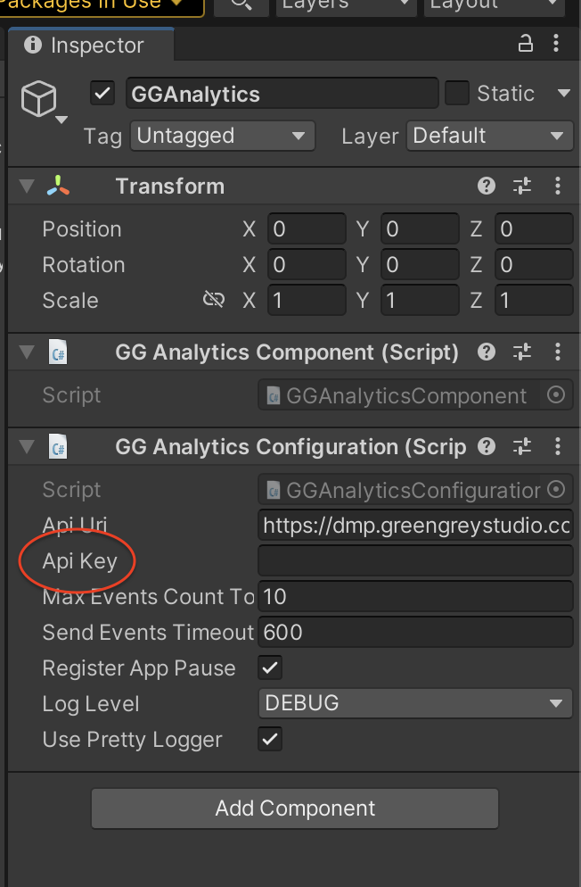
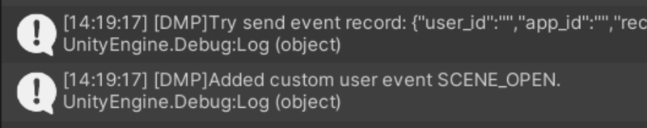
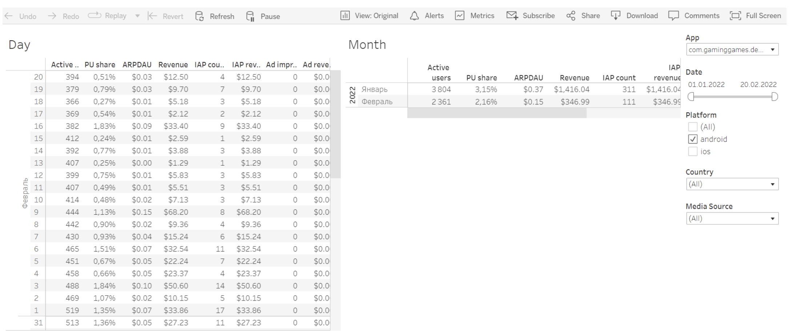

# Библиотека GGAnalytics для Unity

Библиотека **GGAnalitics**  - это библиотека, которая используется для сбора данных о приложении. Библиотека собирает данные о продукте и поведении для своей собственной аналитической службы.  

Аналитика содержит:

* повторяющиеся события, такие как запуск приложения, закрытие приложения, сворачивание окна приложения;

* события разработчика.

Все внутренние и внешние (партнерские) проекты используют следующую таксономию:

|Событие     | Параметры                                                   |Описание                                                                                                                                                     |
|----------| -------------------------------------------------------------|----------------------------------------------------------------------------------------------------------------------------------------------------------------|
|install   |                                                              |Событие, отправленное при запуске SDK                                                                                                                                  |
|id_confirm|                                                              |Для ios. Группа событий для ограничений idfa/adid. Может быть отправлена более одного раза.                                                                       |
|          | status: confirmed, declined                                  |Согласие/несогласие пользователя на отправку id.                                                                                                               |
|session   |                                                              |Событие, отправленное при запуске сессии.                                                                                                                                  |
|          | session_id                                                   |Уникальный id для каждой сессии указывается в начале сессии во всех событиях.                                                                    |
|progress  |                                                              |События прогресса, которые обычно представляют собой завершение уровней (основное) или повышение уровня учетной записи (мета)                                                                      |
|          | type: core, meta, event, social                              |                                                                                                                                                                |
|          | name                                                         |Имя, определяющее прогресс (уровень игры, уровень учетной записи, место в рейтинге события или гильдии и т. д.)                                                                  |
|          | value                                                        |Новое значение, определяющее прогресс.                                                                                                                                |
|          | status: complete, incomplete, failed, other                  |Статус                                                                                                                                                          |
|economics |                                                              |Событие для отображения каждого потока валюты в игре                                                                                                                 |
|          | source_type: store, limited_time_offer, one_time_offer, other|Область игрового процесса, связанная с покупкой                                                                                                                          |
|          | currency: soft, hard, other                                  |Тип валюты: можно настроить, как у рун Archero                                                                                                            |
|          | source_name                                                  |Дисплей, элемент игрового процесса, функция или страница магазина, на которой была совершена покупка                                                                                    |
|          | name                                                         |Наименование покупки                                                                                                                                                   |
|          | value                                                        |Сумма полученной или потраченной валюты                                                                                                                            |
|other     |                                                              |Каждая игра будет содержать действия, которые не попадают в стандартные категории прогресса или расходования ресурсов. Для этих целей должны быть созданы пользовательские события.|
|purchase  |                                                              |Покупки в приложении                                                                                                                                                |
|          | type: direct, offer                                          |Тип: прямая покупка в магазине или предложение покупки. Доступны другие варианты                                                                                            |
|          | source_name                                                  |Дисплей, функция или страница магазина, где была совершена покупка                                                                                                      |
|          | name                                                         |Наименование покупки                                                                                                                                                   |
|          | status: confirmed, unconfirmed                               |Статус покупки: прошла ли транзакция успешно                                                                                                  |
|          | revenue                                                      |Настройки по умолчанию: доллары, без налогов, AF самокалькуляция                                                                                                         |
|ab_group  | test_name                                                    |Тестовое наименование                                                                                                                                                    |
|          | test_group                                                   |Назначенная пользователем группа                                                                                                                                           |
|ad_view   |                                                              |Любая пользовательская активность с рекламой                                                                                                                        |
|          | status: start, end, break, error                             |Статус: старт/конец/прерывание просмотра или ошибка во время проигрывания рекламы                                                                                           |
|          | value                                                        |Дополнительная информация (в частности, код ошибки)                                                                                                            |
|          | type: interstitial, rewarded, banner, other                  |                                                                                                                                                                |
|          | placement                                                    |Размещение внутриигровой рекламы                                                                                                                                   |
|          | revenue                                                      |Настройки по умолчанию: доллары, без налогов. Эти данные передаются в приложение.                                                                              |

Дополнительные события могут быть встроены в проект по необходимости.

Все события сохраняются в базе данных и могут быть проанализированы с помощью интерфейса **Tableau**.

Плюсы использования аналитики:

* собственный бесплатный аналитический сервис;
* поиск, фильтрация и сортировка больших объемов данных с собственными настройками;
* экономия времени: данные из разных источников (посредничество, сервисы маркетинговой и продуктовой аналитики и т. д.) хранятся и анализируются с помощью одного сервиса
* обоснованные прогнозы: сервисы аналитики позволяют не только оценить проект со всех сторон в рамках единой экосистемы, но и сравнить его с другими проектами. На основе этой аналитики строятся более эффективные прогнозы и гипотезы.

[Требования для подключения](#connection-requirements)

[Как настроить библиотеку GGAnalyticsy](#how-to-configure-gg-analytics-library)

[Как добавить библиотеку GGAnalytics в проект](#how-to-add-gg-analytics-library-to-the-project)

[Как отслеживать покупки](#how-to-track-purchase)

[Как отслеживать случайные события](#how-to-track-random-events)

[Как проверить, что интеграция прошла успешно](#how-to-check-up-the-successful-integration)

## Требования для подключения <a name="#connection-requirements"></a>

### Требования к ПО

* Unity ПО, версия не ниже 2019.x

* как минимум один рабочий проект

### Как получить токен

Токен *analytics_project_key* - это идентификационный ключ проекта в системе аналитики.

Чтобы получить токен, пришлите следующую информацию на адрес  a.bobrov@greengreystudio.com:

* Package ID

* Android/iOS

## Как добавить библиотеку GGAnalytics в проект <a name="#how-to-add-gg-analytics-library-to-the-project"></a>

Существует три способа добавления библиотеки **GGAnalytics** в проект:

* с помощью проекта Unity;
* с помощью кода;
* комбинированный.

Примеры доступны в **Green Grey Analytics Unity module**:



### Как добавить GGAnalyticsв проект с помощью проекта Unity

Чтобы добавить библиотеку в проект Unity:

1. Откройте окно **Package Manager** из выпадающего меню **Window**

2. Кликните  **+** и выберите **Add package from git URL…**  из выпадающего меню   


  
  
3. Введите следующую ссылку в открывшуюся строку с кликните **Add**:

`https://github.com/GreenGreyStudioOfficial/dmp_unity_library.git#1.3.4`

4. Создайте объект игры **GGAnalytics** для текущей сцены.  

> ⚠️ Чтобы инициализировать игровой объект **GGAnalytics** из работающего приложения, перейдите к начальной сцене перед созданием объекта. 

Для этого перейдите **GreenGrey → Analytics → Create GGAnalytics GameObject**

**GGAnalytics**  будет показан на панели **Hierarchy**:



> ℹ️ Объект **GGAnalytics** управляет отправкой аналитической информации на сервер.

  5. Кликните по объекту **GGAnalytics**, чтобы открыть настройки в панели **Inspector**

  6. Укажите полученный токен в поле **Api Key** на панели **GG Analytics Configuration (Script)**
  



> ⚠️ **Api Key** используется, пока включен **Debug Mode**. Для релизных версий **Debug Mode** должен быть выключен. Используйте релизный ключ.

### Как добавить библиотеку GGAnalytics в проект через код

Инициализируйте библиотеку, добавив следующий код:

```
private void InitAndSetupAnalytics()
        {
            var go = new GameObject("GGAnalytics");
            DontDestroyOnLoad(go);
            GGAnalyticsInstance.Create(go);
            var configuration = new GGAnalyticsConfigurationExampleSample3();
            GGAnalyticsInstance.Setup(configuration);
        }
```

 И настройте библиотеку, используя следующий код:

```
public class GGAnalyticsConfigurationExampleSample3 : IGGAnalyticsConfiguration
    {
        public string ApiUri => "[https://dmp.greengreystudio.com/events](https://dmp.greengreystudio.com/events)";
        public LogLevel LogLevel => LogLevel.DEBUG;
        public string ApiKey => "779a42bdbebeccc7099de0aaff8b7298d4c22638a95028c362da50bcc5da9e67";
        public uint MaxEventsCountToSend => 10;
        public uint SendEventsTimeoutInSec => 600;
        public bool RegisterAppPause => true;
        public bool UsePrettyLogger => false;
    }
```

Все параметры описаны [здесь](#how-to-configure-gganalytics-library).

### Комбинированный способ добавления библиотеки GGAnalytics в проект

Вы также можете инициализировать библиотеку, добавив следующий код:

```
private void InitAndSetupAnalytics()
        {
            var go = new GameObject("GGAnalytics");
            DontDestroyOnLoad(go);
            GGAnalyticsInstance.Create(go);
            var configuration = new GGAnalyticsConfigurationExampleSample3();
            GGAnalyticsInstance.Setup(configuration);
        }
```

И настроить библиотеку на панели **GG Analytica Configuration (Script)** проекта Unity.

### Как настроить библиотеку GGAnalytics <a name="how-to-configure-gg-analytics-library"></a>

Библиотека может быть настроена на панеле **GG Analytics Configuration (Script)**

 
 
Настройки описаны в таблице ниже:

|Настройки                   |Описание                                                                                                                                                                                                    | Значение                    |
|--------------------------|-------------------------------------------------------------------------------------------------------------------------------------------------------------------------------------------------------------- | ------------------------ |
|Api URL                   |Адрес бэкенда статистики                                                                                                                                                                                | не менять            |
|Api Key             |Аналитический ключ, используемый для отправки сообщений при разработке/тестировании                                                                                                                                                | значение токена                    |
|Max Events Count to Send  |Максимальное количество событий в пакете для отправки на сервер статистики                                                                                                                                        | 5 (минимальное значение)        |
|Send Events Timeout In Sec|Таймаут, после которого пакет будет отправлен на сервер, даже если максимальное количество событий в ней не достигнуто                                                                                                 | 100 (минимальное значение)      |
|Debug Mode                |Ведение журнала отладки в командной строке при интеграции библиотеки. Рекомендуется включать во время интеграции                                                                                      | turned off (рекомендовано) |
|Register App Pause        |Фиксация в журнале отладки каждый раз, когда приложение было свернуто/приостановлено. Рекомендуется отключить во время интеграции                                                                                | turned on (рекомендовано)  |
|Log Level                 |Значения в журнале регистрации в консоли Unity. Содержат следующие значения: DEBUG (регистрация всех сообщений), WARNING (регистрация предупреждений и ошибок), ERROR (регистрация только сообщений об ошибках), OFF (регистрация выключена)    | DEBUG (по умолчанию)       |

## Как отслеживать покупки <a name="#how-to-track-purchase"></a>

Для отслеживания любых событий используйте методы глобального объекта **GGAnalytics.Instance**

Для отслеживания покупок используйте метод **LogPurchase**

`void LogPurchase(string _currency, float _value, Dictionary<string, object> _eventParams);`  
или  
`void LogPurchase(string _currency, float _value);`

| Переменная    | Описание                                                                      |
| ----------- | -------------------------------------------------------------------------------- |
| currency    | Трехбувенный код валюты покупки по ISO 4217. Указывается в  ““  |
| value       | Цена покупки. Указывается в формате float                                        |
| eventParams | Дополнительные параметры пользователя                                                     |

Пример:

```
GGAnalytics.Instance.LogPurchase("USD", 0.99f, new Dictionary<string, object>  
{  
   ["lot"] = "big_coins_pack",  
   ["from"] = "fullscreen_offer",  
   ["show_count"] = 2   
});  
```

## Как отслеживать случайные события <a name="#how-to-track-random-events"></a>

Для отслеживания любых событий используйте методы глобального объекта **GGAnalytics.Instance**

Для отслеживания случайных событий используйте метод **LogEvent**

`void LogEvent(string _eventName, Dictionary<string, object> _eventParams);`  
или  
`void LogEvent(string _eventName);`

| Переменная    | Описание                  |
| ----------- | ---------------------------- |
| eventName   | Наименование события            |
| eventParams | Дополнительные параметры пользователя |

Пример:

```
GGAnalytics.Instance.LogEvent("SCENE_OPEN", new Dictionary<string, object>
{
   {"scene_index", currentSceneIndex},
   {"scene_name", SceneManager.GetActiveScene().name}
});
```

## Как проверить, что интеграция прошла успешно <a name="#how-to-check-up-the-successful-integration"></a>

Сообщения об отправленных событиях должны быть показаны в командной строке каждый раз, когда метод **GGAnalitics.Instance** вызывается.

> ⚠️ Убедитесь, что режим **Debug Mode** выключен (см. [Как настроить библиотеку GGAnalytics](#how-to-configure-gg-analytics-library))



Для проверки валидации сообщений используйте личный кабинет в **Tableau**.

> ℹ️ Доступ к личному кабинету вы получите вместе с токеном от менеджера GreenGrey

Для этого:

1. Залогиньтесь в [online.tableau.com](online.tableau.com). Все события, отправленные из вашего приложения, отображаются в личном кабинете

2. Убедитесь, что все сообщения, отправленные с вашего приложения, получены сервером

